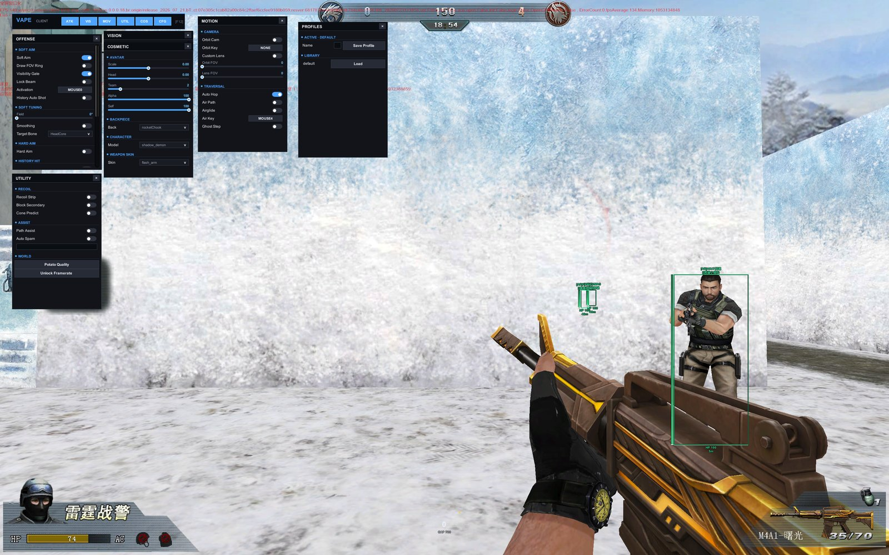
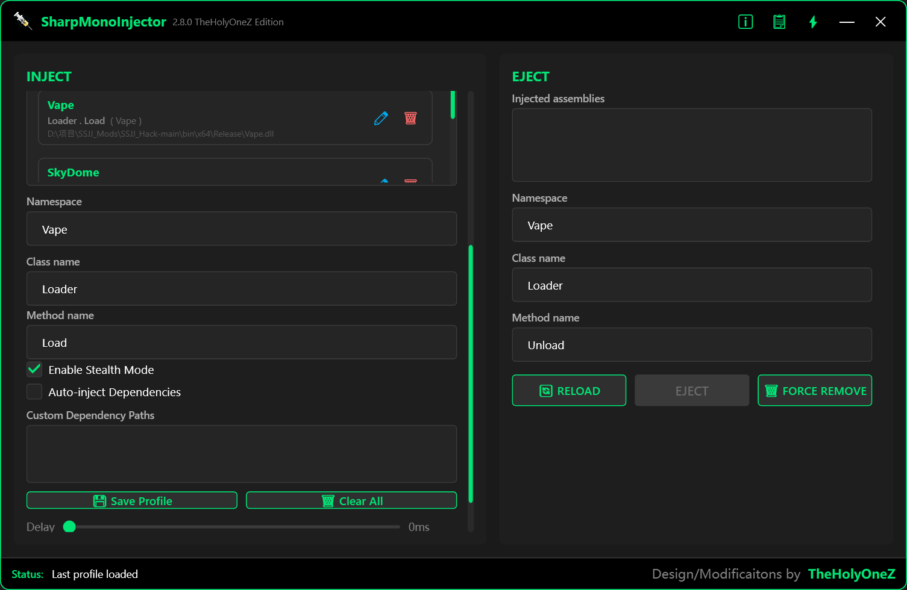

# SSJJ_Vape

面向 **生死狙击（Unity/Mono）** 的研究用注入模块。提供可拖拽多窗口 ClickGUI、ESP/辅助视觉、自瞄与配置系统。

> 仅供学习、研究与**授权环境**测试。请遵守当地法律与游戏服务条款。

---

## 预览

### 使用示意图（游戏内菜单）



### 注入截图（SharpMonoInjector）



---

## 功能概览

| 分类 | 内容 |
| --- | --- |
| **UI** | 多窗口 ClickGUI、自定义开关/滑条/分段控件，热键 **F12** |
| **Vision** | ESP 方框/骨骼/血条/名字/距离、雷达、物品/Buff 标签、观战列表等 |
| **Offense** | Soft Aim、Hard Aim、Auto Fire、History Hit、Desync、Packet Hold |
| **Motion** | Auto Hop、Air Path、Orbit Cam、FOV |
| **Misc** | Recoil Strip、换肤入口、配置存取、画质/帧率快捷项 |
| **Overlay** | 可选外部 DX11 + ImGui 菜单（`Overlay/Vape.Overlay`） |

---

## 环境要求

- 游戏客户端：生死狙击微端（Unity Mono）
- 构建：Visual Studio / MSBuild，**.NET Framework 4.8**，`Release | x64`
- 注入器：[SharpMonoInjector 2.7 - TheHolyOneZ Edition](https://github.com/TheHolyOneZ/SharpMonoInjector-2.7-TheHolyOneZ-Edition-)
- 可选 Overlay：需安装 **.NET 10** 运行时

---

## 构建

```bash
# 游戏模块
dotnet msbuild Vape.csproj -p:Configuration=Release -p:Platform=x64

# 可选：外部 ImGui 菜单
dotnet build Overlay/Vape.Overlay.csproj -c Release
```

输出：

- `bin/x64/Release/Vape.dll`
- `Overlay/bin/Release/net10.0-windows/Vape.Overlay.exe`（可选）

### 关于 `引用/` 目录

本仓库**不包含**游戏原版程序集。请自行从本地客户端复制所需 DLL 到 `引用/`（与 `Vape.csproj` 中 HintPath 一致）后再编译。

---

## 注入步骤

1. 启动生死狙击并进入可战斗场景（或大厅，视你的测试需求）。
2. 以管理员身份打开 [SharpMonoInjector-2.7-TheHolyOneZ-Edition](https://github.com/TheHolyOneZ/SharpMonoInjector-2.7-TheHolyOneZ-Edition-)。
3. 选择进程（游戏进程）。
4. Assembly 选择编译好的 `Vape.dll`。
5. 填写：
   - **Namespace**: `Vape` 或短入口 `t`
   - **Class**: `Loader` 或 `u`
   - **Method**: `Load` 或 `i`
6. 点击 Inject。成功后可用 **F12** 开关菜单。

推荐入口：

| 项 | 值 |
| --- | --- |
| Namespace | `Vape` |
| Class | `Loader` |
| Method | `Load` |

兼容短入口：`t.u.i()`。

参考注入界面：


---

## 操作说明

| 按键 | 作用 |
| --- | --- |
| **F12** | 打开 / 关闭菜单 |
| 菜单内 Chip | 开关各分类窗口（ATK / VIS / MOV / UTIL / COS / CFG） |
| 配置页 | 保存 / 加载 / 删除配置（目录：`persistentDataPath/VapeConfigs`） |

可选：注入后启动 `Vape.Overlay.exe`，外部 ImGui 菜单会通过共享内存与游戏内配置同步；连接成功时进程内菜单会自动让路。

---

## 项目结构

```text
Vape/
├── Cfg/            配置、菜单
├── UI/             Theme、Widgets、Overlay 同步
├── Feature/        功能实现（Legit / Rage / Visuals ...）
├── Entity/         玩家实体同步
├── Render/         立即模式绘制
├── MonoMod_Hook/   本地方法 Hook
├── Overlay/        外部 DX11 ImGui 菜单
├── Resources/      字体等嵌入资源
├── docs/images/    README 配图
├── Vape.csproj
└── Vape.sln
```

---

## 注入器

本项目推荐使用：

**[TheHolyOneZ/SharpMonoInjector-2.7-TheHolyOneZ-Edition-](https://github.com/TheHolyOneZ/SharpMonoInjector-2.7-TheHolyOneZ-Edition-)**

SharpMonoInjector 可用于将 .NET 程序集注入到使用 Mono 运行时的 Unity 进程。

---

## 免责声明

- 本仓库仅用于技术研究与教育目的。
- 作者不对使用本软件造成的任何账号处罚、损失或法律后果负责。
- 请勿在未授权的线上环境使用。
- 禁止将本项目用于任何商业或破坏公平竞赛的用途。

---

## License

未另行声明时，保留所有权利。二次分发请自担合规风险，并移除任何你无权分发的第三方/游戏文件。
