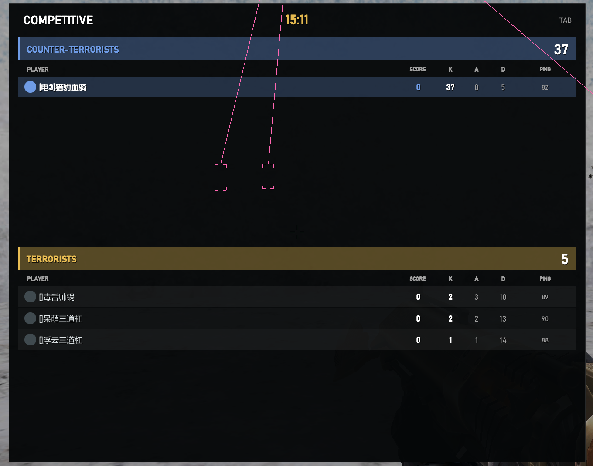
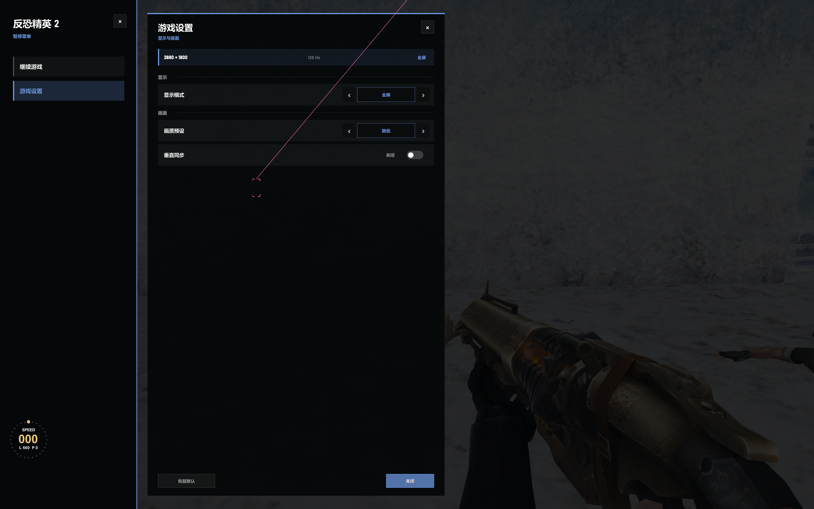
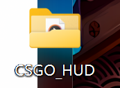
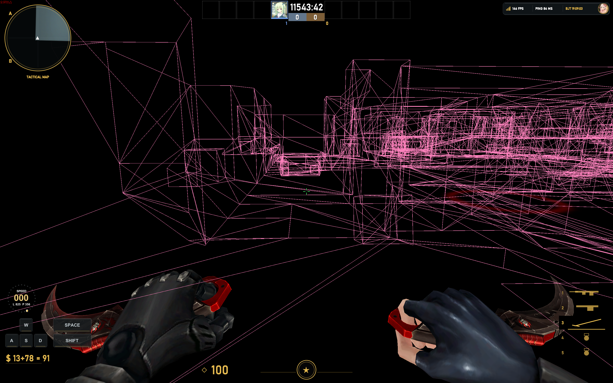
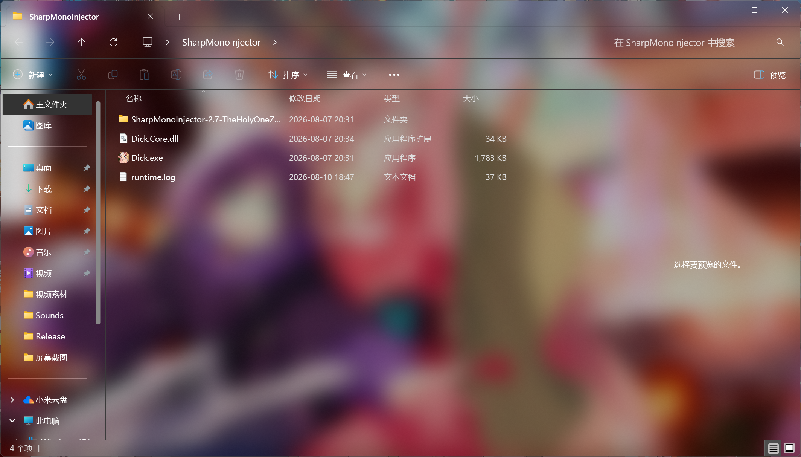

# SSJJ_Vape

面向 Unity/Mono 测试环境的研究用模块，包含 HUD、ClickGUI、配置系统和若干运行时实验功能。

本仓库只适用于你拥有或明确获准测试的程序。请勿用于未授权的线上游戏、绕过安全产品或破坏公平竞赛。使用前请确认所有第三方代码、游戏程序集、字体、音效和图片都具备合法的再分发权限。

## 预览图


### 驱动保护过检测


### 菜单GUI卡


### 图片、音效资源调用


### 注入器配置页面


### CSGO风格击杀图标


### CSGO风格HUD



### Esc游戏设置HUD.



## 功能概览

- 卡片式 ClickGUI、中文界面和配置保存/加载
- CSGO 风格 HUD：雷达、计分板、击杀提示、武器栏、状态信息和游戏设置页
- 视觉模块：ESP、骨骼、血条、名字、距离、物品和 Buff 标签
- 输入与移动实验模块、反冲处理、即时开镜等功能
- 回溯模块已从当前版本完整移除

## 项目结构

```text
SSJJ_Vape/
├── Cfg/                         配置和菜单逻辑
├── Console/                     运行时控制台
├── Core/                        Hook 与方法处理核心
├── Entity/                      玩家实体同步
├── Feature/                     HUD、视觉和功能模块
├── UI/                          主题、控件和卡片菜单
├── Render/                      立即模式绘制
├── Resources/                   嵌入字体和项目资源
├── 依赖/                        编译所需的游戏/Unity 程序集
├── CSGO_HUD/                    运行时从桌面读取的外部图片和音效
├── tools/DickInjector/          Dick.exe 与 Dick.Core.dll
├── docs/images/                 README 预览图
├── 底层组件/                    可选的 C/C++ 原生研究工程
├── bin/Release/                 Release 输出
├── bin/x64/Release/             Release x64 输出
├── Vape.csproj
└── Vape.sln
```

## 环境要求

- Windows x64
- Visual Studio / MSBuild
- .NET Framework 4.8 Developer Pack
- Unity Mono 测试目标
- 构建时保留仓库根目录的 `依赖/` 目录

## 构建

仓库保留依赖和 Release 输出，直接使用下面的命令可以重新构建 x64 版本：

```powershell
dotnet msbuild Vape.csproj -t:Rebuild -p:Configuration=Release -p:Platform=x64
```

输出文件：

- `bin/x64/Release/Vape.dll`
- `bin/Release/Vape.dll`

不要删除 `依赖/`。`Vape.csproj` 的引用路径已经指向该目录。`obj/`、`底层组件/build/` 和 `底层组件/dist/` 属于本机构建中间产物，不是手动使用托管 DLL 所需的内容。

## CSGO_HUD 外部资源

`CsgoHud` 会从当前用户桌面读取固定目录：

```text
C:\Users\<用户名>\Desktop\CSGO_HUD\
```

桌面目录示例（图一）：



### CSGO_HUD 功能示例（图二）



因此，运行测试前请把仓库里的 `CSGO_HUD/` 整个文件夹复制到桌面，目录名和文件名都不要改。当前目录包含：

- `profile_avatar.jpg`
- `player_avatar_1.png`、`player_avatar_2.png`、`player_avatar_3.png`
- `kill_card_1_spade.png`、`kill_card_2_joker.png`、`kill_card_3_thunder.png`、`kill_card_4_death.png`
- `kill_spade_skull.png`
- `kill_glass.wav`、`kill_glass.ogg`
- `menu_font.ttf`、`ProggyTiny.ttf`

资源缺失时 HUD 仍可启动，但头像、击杀卡片、音效或字体会回退到简化显示。

## Dick 注入器

仓库中的注入器发布目录是：

```text
tools/DickInjector/
├── Dick.exe
├── Dick.Core.dll
└── THIRD_PARTY_LICENSE.txt
```

`Dick.exe` 和 `Dick.Core.dll` 必须放在同一个目录。图三中的 `runtime.log` 是本机运行日志，包含进程名、PID、时间和运行记录，不随项目发布。

注入器目录示例（图三）：



### 授权测试教程

以下流程只适用于你拥有或明确获准测试的 Unity/Mono 程序：

1. 将 `tools/DickInjector/` 复制到桌面，例如 `C:\Users\Mahuilai\Desktop\SharpMonoInjector\`。
2. 确认 `Dick.exe` 与 `Dick.Core.dll` 位于同一层目录。

3. 将 `CSGO_HUD/` 复制到桌面，并准备好 `bin/x64/Release/Vape.dll`。

4. 启动你自己的 Unity/Mono 测试程序，并进入允许加载测试模块的场景。

5. 运行 `Dick.exe`，选择目标 Mono 进程和 `Vape.dll`。

6. 使用以下入口配置：

   | 项目 | 值 |
   | --- | --- |
   | Namespace | `Vape` |
   | Class | `Loader` |
   | Method | `Load` |

7. 执行加载后，按模块自身的入口约定验证结果。出现异常时先查看注入器日志和 Unity 日志。

不要在未授权的线上环境使用。。。

## 许可证与免责声明

当前仓库没有为所有内容授予统一许可证。项目源码、游戏程序集、资源文件、`Dick` 注入器及其他第三方组件的版权和许可范围可能不同；发布者应在公开仓库前分别确认授权，并在必要时替换或补充许可证文件。

本项目仅用于授权环境中的软件工程研究、Unity/Mono 调试和安全研究。使用者自行承担违反法律、软件许可、服务条款或造成数据损失的责任。
